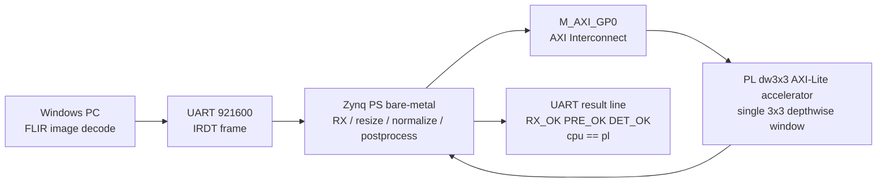

# UART Image + PL DW3X3 Demo

## 目标

这份 demo 文档用于固化当前已经在真实 Zynq-7020 板上跑通的成果：

- PC 从 `FLIR_ADAS_v2` 中读取一张热红外图片。
- PC 解码图片，并通过 UART 发送灰度像素流和宽高头。
- Zynq PS 裸机程序接收图片，完成帧校验、resize、normalize 和后处理占位输出。
- Zynq PL 中的 `MobileNetV2 depthwise 3x3` 单窗口算子通过 AXI-Lite 被 PS 调用。
- UART 返回检测结果，并附带 CPU/PL depthwise 3x3 对比结果。

这个 demo 不表示整网已经全部在 PL 中运行。它证明的是：检测部署链路已经闭环，并且 PL 已经能够承担模型关键算子的可验证加速单元。

## 当前版本证明了什么



已经验证的关键点：

- PS UART 可接收 PC 发送的解码后灰度图。
- 图像帧 checksum 通过。
- 板端预处理输出固定为 `160x128`。
- PS 可以通过 `M_AXI_GP0` 访问 PL AXI-Lite 外设。
- AXI GPIO 探针读写通过，说明 AXI 基础通路有效。
- 自定义 `dw3x3` PL 外设 info 寄存器可读。
- `dw3x3` 单窗口计算结果和 CPU 参考值一致。
- 当前 UART 图像链路中已经会调用 PL 算子，输出 `pl_dw3x3_rc=0 cpu=<value> pl=<value>`。

## 环境

- 主机系统：Windows
- Vivado：2020.2
- Vitis：2020.2
- Xilinx 安装路径：`F:\Xilinx`
- 工程路径：`G:\FPGA\ir_zynq_detector`
- 数据集路径：`G:\chormxiazai\FLIR_ADAS_v2`
- 板端应用 UART 波特率：`921600`
- U-Boot 默认 UART 波特率：通常是 `115200`

注意：如果串口助手设置成 `115200`，可能能看到 U-Boot，但会看不懂本工程裸机应用输出；如果设置成 `921600`，本工程应用输出正常，但 U-Boot 可能乱码。这是正常现象。

## Demo 1：PL DW3X3 自测

### 1. 构建 bitstream

如果已经有最新 bitstream，可以跳过。

```powershell
F:\Xilinx\Vivado\2020.2\bin\vivado.bat `
  -mode batch `
  -source G:\FPGA\ir_zynq_detector\hw\vivado\build_bitstream.tcl
```

预期生成：

- `G:\FPGA\ir_zynq_detector\build\vivado\ir_zynq_detector.runs\impl_1\system_wrapper.bit`
- `G:\FPGA\ir_zynq_detector\build\vivado\export\ir_zynq_detector.xsa`

### 2. 构建自测应用

```powershell
F:\Xilinx\Vitis\2020.2\bin\xsct.bat `
  G:\FPGA\ir_zynq_detector\vitis\create_dw3x3_selftest_app.tcl
```

预期生成：

- `G:\FPGA\ir_zynq_detector\build\vitis_dw3x3_selftest\irdet_dw3x3_selftest\Debug\irdet_dw3x3_selftest.elf`

### 3. 下载并运行

```powershell
F:\Xilinx\Vitis\2020.2\bin\xsct.bat `
  G:\FPGA\ir_zynq_detector\vitis\run_dw3x3_selftest_on_board.tcl
```

串口助手设置：

- 端口：按设备管理器实际端口，例如 `COM3`
- 波特率：`921600`
- 数据位：`8`
- 停止位：`1`
- 校验：None

### 4. 预期输出

```text
IR detector PL dw3x3 bare-metal selftest
This app assumes the PL bitstream is already programmed.
PL dw3x3 accelerator present at 0x43C00000.
PL dw3x3 starting AXI MMIO single-window test...
AXI GPIO probe base=0x41200000 writing TRI...
AXI GPIO probe writing DATA=0xA5A55A5A...
AXI GPIO probe reading DATA...
AXI GPIO probe readback=0xA5A55A5A
PL dw3x3 reading INFO register...
PL dw3x3 info=0xD3030302
PL dw3x3 configure window...
PL dw3x3 write pixels...
PL dw3x3 write weights...
PL dw3x3 start core...
PL dw3x3 wait done...
PL dw3x3 read output...
PL dw3x3 selftest PASS base=0x43C00000 mode=single_window result=45
PL dw3x3 starting real MobileNetV2 window replay channel=11 y=19 x=7...
PL dw3x3 realcase PASS channel=11 y=19 x=7 expected_acc=-180792 pl_acc=-180792 scale=65536
PL dw3x3 starting real MobileNetV2 batch replay channel=11 count=16 patch=4x4...
PL dw3x3 batch PASS channel=11 count=16 first_acc=11848 last_acc=26589 scale=65536 cpu_us=7 pl_us=178 pl_per_window_us_x1000=11125
PL dw3x3 starting real MobileNetV2 channel replay channel=11 count=1280 patch=40x32...
PL dw3x3 channel PASS channel=11 count=1280 first_acc=93502 last_acc=-18304 scale=65536 cpu_us=553 pl_us=13489 pl_per_window_us_x1000=10538
PL dw3x3 full scheduler present at 0x43C10000 info=0xF3282006
PL dw3x3 starting full-channel scheduler channel=11 count=1280 shape=40x32...
PL dw3x3 full scheduler PASS channel=11 count=1280 first_acc=93502 last_acc=-18304 e2e_us=3020 compute_us=692 e2e_per_output_us_x1000=2359
PL dw3x3 selftest rc=0
```

这说明 PS 到 PL 的 AXI-Lite 通路和 `dw3x3` 计算单元已经通过板级验证。
其中 `result=45` 是简单 synthetic 用例，`realcase PASS` 是从已训练 SSDLite-MobileNetV2 中导出的真实 depthwise 3x3 窗口、权重和 bias。`batch PASS` 是同一个 channel 上 `4x4` 个相邻窗口的连续 PS->PL 调度验证；`channel PASS` 则扩展到完整 `40x32=1280` 个窗口，并输出 CPU 参考计算耗时和 PL 调度耗时。

性能解释见 [pl_dw3x3_performance_analysis.md](/G:/FPGA/ir_zynq_detector/docs/pl_dw3x3_performance_analysis.md)。当前 AXI-Lite 单窗口版本用于证明功能正确和 PS/PL 集成可靠，吞吐性能受每个窗口多次寄存器访问限制，下一版应把滑窗调度放进 PL 内部。

## Demo 2：UART 发送 FLIR 图片并调用 PL 算子

### 1. 运行板端 UART 接收应用

```powershell
F:\Xilinx\Vitis\2020.2\bin\xsct.bat `
  G:\FPGA\ir_zynq_detector\vitis\run_uart_rx_on_board.tcl
```

这个脚本会按已经验证的顺序执行：

- system reset
- `ps7_init`
- program PL bitstream
- `ps7_post_config`
- download ELF
- run CPU

这个顺序很重要。之前验证表明，如果 PL 编程和 PS 初始化顺序不对，PS 访问 PL AXI 外设可能会卡住。

### 2. PC 发送一张 FLIR 热红外图片

```powershell
python G:\FPGA\ir_zynq_detector\pc\tools\send_uart_image.py `
  --dataset-root "G:\chormxiazai\FLIR_ADAS_v2" `
  --match "images_thermal_val\data" `
  --index 0 `
  --port COM3 `
  --baud 921600 `
  --wait-ack
```

### 3. 已验证输出

当前板端已经返回过下面这类结果：

```text
frame_id=1 width=640 height=512 payload=327680 checksum_rx=0x0280F887 checksum_calc=0x0280F887 pre_in=640x512 pre_out=160x128 min=1 max=255 mean_x1000=502 pl_dw3x3_rc=0 cpu=91 pl=91 det_count=1 RX_OK PRE_OK DET_OK class=person score=0.907 bbox=[40,34,119,91]
```

关键字段含义：

- `checksum_rx == checksum_calc`：PC 发送和板端接收的数据一致。
- `pre_in=640x512`：原始 FLIR 图片尺寸。
- `pre_out=160x128`：板端统一后的模型输入尺寸。
- `pl_dw3x3_rc=0`：PL depthwise 3x3 调用成功。
- `cpu=91 pl=91`：同一个窗口的 CPU 参考结果和 PL 结果一致。
- `RX_OK PRE_OK DET_OK`：收图、预处理、后处理链路状态正常。
- `class=person score=0.907 bbox=[40,34,119,91]`：当前仍是板端占位检测接口输出，后续会替换为真实模型推理结果。

## 当前边界

当前 demo 已经完成：

- 离线图片从 PC 到板端的传输闭环。
- 板端图像预处理闭环。
- 板端检测结果输出格式闭环。
- PL depthwise 3x3 算子板级访问和计算闭环。
- UART 图像链路中集成 PL 算子探针。
- 已新增真实 MobileNetV2 depthwise 单窗口回放自测，用于把 PL 算子和训练模型导出的真实参数对应起来。

当前 demo 还没有完成：

- 在板端运行完整 SSDLite-MobileNetV2 推理。
- 把完整 depthwise feature map 全部交给 PL 计算。
- 使用 DMA/AXI-Stream 做高吞吐搬运。
- 输出真实训练模型的检测框。

## 常见问题

### 1. `fpga configuration failed. DONE PIN is not HIGH`

优先检查：

- bitstream 是否对应当前实际 FPGA 型号。
- 板卡电源/JTAG 是否稳定。
- bitstream 是否重新生成成功。

如果 probe 脚本能看到目标，但编程失败，重点确认实际芯片型号是否和脚本中的 `xc7z020clg400-1` 一致。

### 2. 程序卡在 `AXI GPIO probe writing DATA`

这说明问题不在自定义 `dw3x3` 模块本身，而在更基础的 PS/PL AXI 通路上。

优先检查：

- `M_AXI_GP0` 是否启用。
- FCLK0 是否连接到 AXI 外设。
- reset 极性是否正确。
- XSCT 运行脚本是否使用 `ps7_init -> program PL -> ps7_post_config` 的顺序。

### 3. 串口乱码

- 看 U-Boot：通常用 `115200`。
- 看本工程裸机应用：用 `921600`。

### 4. Vitis GUI 或 `app build` 很慢

如果工程已经创建好，可以进入 `Debug` 目录直接调用 Vitis 附带的 `make.exe` 增量编译。但正式文档和复现流程仍以 XSCT 脚本为准。

## 下一条推进路线

最合理的下一步不是马上做整网 PL 化，而是：

1. 继续保留当前 UART + PL demo 作为稳定基线。
2. 将 PL `dw3x3` selftest 从 synthetic 输入升级为真实 MobileNetV2 depthwise 层导出的窗口、权重和 bias。
3. 在 PS 上读取真实测试向量，调用 PL，比较 `expected_acc` 和 `pl_acc`。
4. 通过后，再做 PS 管理的滑窗调度，逐步扩大到一个 channel 的 feature map。
5. 最后再评估是否引入 DMA/AXI-Stream，或者转向 Linux + 轻量推理库集成完整模型。

这样推进的好处是每一步都有明确验收标准，而且不会把风险一次性堆到“完整模型板端推理”上。
