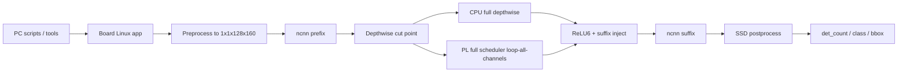

# GitHub 学习导图

这份文档面向这样的使用方式：

- 你在另一台电脑上
- 主要通过 GitHub 网页阅读项目
- 这几天的目标是先把工程主线、代码入口、验证状态看明白
- 不是立刻在本机复现训练、综合、上板

也就是说，这是一份“读仓库”和“理解主线”的导图。

## 先说结论

当前 GitHub 仓库里，已经包含：

- 当前阶段的主要源码
- 关键脚本
- 当前验证链路说明
- PC 端可视化 demo 源码
- 这轮新增的 PL 恢复入口

当前 GitHub 仓库里，不包含：

- `build/` 下的大量生成物
- 训练 checkpoint
- 导出的 `ncnn .param/.bin`
- 打包后的 Linux bundle
- bitstream / xsa / elf 等构建产物

所以最准确的理解是：

```text
这个仓库已经足够“学习代码与流程”，
但还不是“换一台机器 clone 后零准备直接跑通板端”。
```

## 为什么不能只靠 clone 直接运行

仓库默认忽略了这些内容：

```text
.venv-train/
build/
outputs/
```

这意味着很多运行期依赖需要在本地重新生成或另外提供。

例如 `pc/scripts/package_zynq_linux_demo.ps1` 依赖：

- `build/zynq_linux_arm_ncnn/irdet_linux_ncnn_app`
- `build/ncnn_runtime_fixed_v2_tracer_op13_ncnn/*.param`
- `build/ncnn_runtime_fixed_v2_tracer_op13_ncnn/*.bin`
- `build/train_ssdlite_ir_fixed_v2/best.pt`
- `build/flir_thermal_3cls_fixed_v2_keepempty/dataset_manifest.json`
- `build/pl_layer_case_depthwise_fixed_v2/*`

所以你在 Mac 上通过 GitHub 学习时，重点应该放在：

- 主线怎么打通
- 代码入口在哪里
- PS / Linux / PL 的边界怎么划
- 当前哪些模式已经真机验证通过

## 推荐阅读顺序

建议按下面顺序读，而不是一上来从某个 `.cpp` 从头翻到尾。

### 1. 先看总入口

- [README.md](../README.md)
- [docs/true_inference_runtime_plan.md](./true_inference_runtime_plan.md)
- [docs/pl_depthwise_accel_status.md](./pl_depthwise_accel_status.md)
- [docs/inpath_dw_stage_report.md](./inpath_dw_stage_report.md)
- [docs/inpath_dw_regression.md](./inpath_dw_regression.md)

这一层回答的是：

- 项目到底想做什么
- 当前做到哪一步
- 哪条链路已经真机通过

### 2. 再看 Linux 真推理主线

先看这些文件：

- [zynq_linux/src/irdet_linux_main.cpp](../zynq_linux/src/irdet_linux_main.cpp)
- [zynq_linux/src/irdet_linux_ncnn_detector.cpp](../zynq_linux/src/irdet_linux_ncnn_detector.cpp)
- [zynq_linux/include/irdet_linux_ncnn_detector.h](../zynq_linux/include/irdet_linux_ncnn_detector.h)

这一层回答的是：

- Linux app 的命令行入口是什么
- `gray8 / runtime_dw_pl_compare / inpath_dw_cpu_full / inpath_dw_pl_full` 分别怎么进
- ncnn detector 怎么加载模型、怎么跑、怎么做 blob override

建议重点看：

- 参数解析
- `run_from_gray8`
- `extract_blob_from_gray8`
- `run_from_runtime_tensor_with_blob_override`

### 3. 再看 in-path depthwise 替换

关键文件：

- [zynq_linux/src/irdet_linux_dw3x3_case.cpp](../zynq_linux/src/irdet_linux_dw3x3_case.cpp)
- [zynq_linux/src/irdet_linux_pl_dw3x3_probe.cpp](../zynq_linux/src/irdet_linux_pl_dw3x3_probe.cpp)
- [docs/inpath_dw_stage_report.md](./inpath_dw_stage_report.md)

这一层回答的是：

- `prefix + CPU depthwise + suffix` 怎么做
- `prefix + PL loop all channels + suffix` 怎么做
- 为什么 `inpath_dw_pl_full` 说明“PL 输出已经真正进入模型推理路径”

这里要抓住一个核心点：

```text
没有切成两个 ncnn 模型文件，
而是通过 override 中间 blob 的办法把 suffix 接回去。
```

### 4. 再看 PL 侧契约与驱动

关键文档和代码：

- [docs/pl_ps_mmio_contract.md](./pl_ps_mmio_contract.md)
- [docs/pl_dw3x3_full_scheduler_demo.md](./pl_dw3x3_full_scheduler_demo.md)
- [zynq_ps/src/ir_pl_dw3x3.c](../zynq_ps/src/ir_pl_dw3x3.c)
- [zynq_ps/src/ir_pl_dw3x3_full.c](../zynq_ps/src/ir_pl_dw3x3_full.c)
- [zynq_pl/rtl/mobilenet_dw3x3_channel_full_axi.sv](../zynq_pl/rtl/mobilenet_dw3x3_channel_full_axi.sv)

这一层回答的是：

- PL full scheduler 的 MMIO 契约是什么
- Linux 侧是怎么一通道一通道循环调用的
- 为什么当前不是最快，但已经足够证明“PL 真正进入推理主线”

### 5. 最后看 PC 端部署与可视化

先看这些：

- [pc/scripts/run_ac880_linux_demo.ps1](../pc/scripts/run_ac880_linux_demo.ps1)
- [pc/scripts/deploy_ac880_linux_demo.py](../pc/scripts/deploy_ac880_linux_demo.py)
- [pc/tools/board_visual_infer.py](../pc/tools/board_visual_infer.py)
- [pc/tools/board_visual_demo_gui.py](../pc/tools/board_visual_demo_gui.py)
- [docs/visual_demo.md](./visual_demo.md)

这一层回答的是：

- PC 怎么把 bundle 发到板子
- PC 怎么选一张图上传推理
- 为什么 `gray8` 模式也会出 bbox
- 板子断电后为什么需要 `Recover PL`

## 当前模式应该怎么理解

最容易混淆的是这三个模式。

### `gray8`

含义不是“只显示灰度图”，而是：

```text
gray8 输入 -> 预处理 -> 全部由完整 ncnn detector 跑完 -> bbox
```

它是基线模式。

### `inpath_dw_cpu_full`

含义是：

```text
prefix -> CPU 算完整 depthwise 层 -> suffix -> bbox
```

它主要用来证明：

- 模型切点正确
- 中间 blob 注回方式正确

### `inpath_dw_pl_full`

含义是：

```text
prefix -> PL 循环 144 个 channel 算完整 depthwise 层 -> suffix -> bbox
```

这是当前最重要的真机成果，因为它证明：

```text
PL 输出已经真正进入模型推理路径。
```

## 一张图看当前工程分层



## 当前已经真机验证的关键结论

建议把下面四件事记牢，它们是当前阶段最重要的结果。

1. Linux/ncnn detector 已经在板端跑通
2. `runtime_dw_pl_compare` 已经证明运行时真实 blob 可以送入 PL，且 CPU/PL 对齐
3. `inpath_dw_cpu_full` 已经证明 cut-point 与 suffix reinject 是正确的
4. `inpath_dw_pl_full` 已经证明 PL 输出进入真实推理路径后，检测结果仍正常

## 在 GitHub 上最值得先点开的文件

如果你这几天时间有限，我推荐优先看下面 10 个文件：

1. [README.md](../README.md)
2. [docs/true_inference_runtime_plan.md](./true_inference_runtime_plan.md)
3. [docs/inpath_dw_stage_report.md](./inpath_dw_stage_report.md)
4. [docs/pl_depthwise_accel_status.md](./pl_depthwise_accel_status.md)
5. [zynq_linux/src/irdet_linux_main.cpp](../zynq_linux/src/irdet_linux_main.cpp)
6. [zynq_linux/src/irdet_linux_ncnn_detector.cpp](../zynq_linux/src/irdet_linux_ncnn_detector.cpp)
7. [zynq_linux/src/irdet_linux_pl_dw3x3_probe.cpp](../zynq_linux/src/irdet_linux_pl_dw3x3_probe.cpp)
8. [pc/scripts/package_zynq_linux_demo.ps1](../pc/scripts/package_zynq_linux_demo.ps1)
9. [pc/tools/board_visual_infer.py](../pc/tools/board_visual_infer.py)
10. [docs/visual_demo.md](./visual_demo.md)

## 对你当前学习最有帮助的额外内容

如果后面还要继续为“GitHub 上纯阅读学习”优化，我建议再补下面这些内容：

- 一份更细的 `函数级调用链导图`
- 一份 `inpath_dw_pl_full` 的逐步时序图
- 一份 `关键日志字段对照表`
- 一份 `Windows 上板流程` 与 `GitHub 阅读学习流程` 的区分文档

这几项都适合继续直接提交到仓库，不依赖 `build/`。
